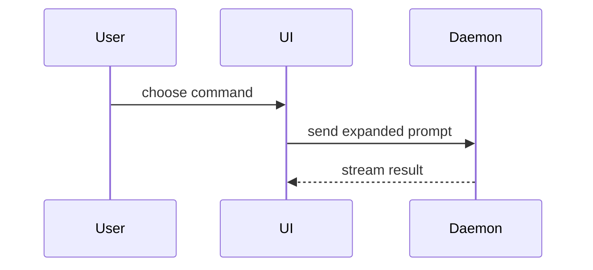

使用以下模板撰写 PR 正文：

```markdown
## Summary

<diagram, diff-sketch, or tree>

## Evidence

- **Before:** <screenshot/output/failing test run>
  **After:** <screenshot/output/passing test run>

## Merge Danger

**Door:** <one-way or two-way>

<optional: description>

**Blast Radius:** <one-word description>

<optional: potential ramifications of merge>
```

## 各节说明

跳过所有开场白，行文保持简洁。使用用户在 `CONTEXT.md` 中的领域语言。

### 摘要（Summary）

选择能讲清关键点的最小视图。

- 把逻辑或算法展示为伪代码：

```text
on(save)
  if content is unchanged
    return cached result
  write new content
  return fresh result
```

- 把运行时控制流展示为调用树：

```text
submitForm
  createSession
    persistPrompt
    launchAgent
  navigateToSession
```

- 把 UI 结构展示为组件树，包含相关的状态和模块边界：

```tsx
<SessionPage>(apps / example / src / routes / session.tsx);
useSessionEvents() < SessionToolbar > <RunSkillButton>(packages / ui);
```

- 把文件职责或大范围重构展示为浅层文件树：

```text
src/
├── commands/       # parses user actions
├── sessions/       # owns session state
└── transport/      # sends API requests
```

- 用 Mermaid 展示组件交互、控制流或数据流：



- 当重点是改了什么、且周围形态已存在时，用 `diff`。diff 形态要贴合主题。

组件变更：

```diff
 <SessionPage>
   useSessionEvents()
   <SessionToolbar>
+    <RunSkillButton />
   <SessionTimeline>
+    <SkillResultCard />
```

文件布局变更：

```diff
 src/
 ├── commands/
+│   └── show-me.ts       # expands the slash command
 ├── sessions/
-└── transport.ts
+└── transport/
+    ├── client.ts
+    └── stream.ts
```

调用树或调用栈变更：

```diff
 submitForm
   createSession
     persistPrompt
+    expandSkillMention
     launchAgent
-  navigateToSession
+  navigateToSession
+    subscribeToEvents
```

状态或控制流变更：

```diff
 on(save)
-  write content
+  if content is unchanged
+    return cached result
+  write new content
+  invalidate cache
```

- 当大部分内容是新增的、当省略上下文会掩盖归属或顺序、当用户需要可复制的目标形态时，展示完整代码块：

```ts
function expandSkill(command: string): string {
  const skillName = command.slice(1);
  return `use the ${skillName} skill`;
}
```

#### 指导原则

把每张图放在它支撑的短文本旁边。只保留回答用户当前问题或解决当前讨论点所需的调用、文件、属性、状态和边界。

可以用其中一种，也可以用几种，但不太可能全用上。自行判断，不要让用户负担过重。

### 证据（Evidence）

证明改动有效的具体证据。展示改动前和改动后。

截图是 S 级证据，适用于环境已就绪且改动可见的情形。

基于执行的证据是 A 级。测试结果、控制台输出。用伪代码展示现在失败又通过的具体测试。

### 合并风险（Merge Danger）

说明这是单向门还是双向门。双向门可以走回头路，单向门不行。容易回滚的 PR 风险较低。涉及破坏性操作或难以逆转决策的变更属于单向门。

爆炸半径是本次 PR 引入变更的潜在影响或范围。考虑所有可能性。例如布局偏移、对调用方的破坏、移动端适配等。
